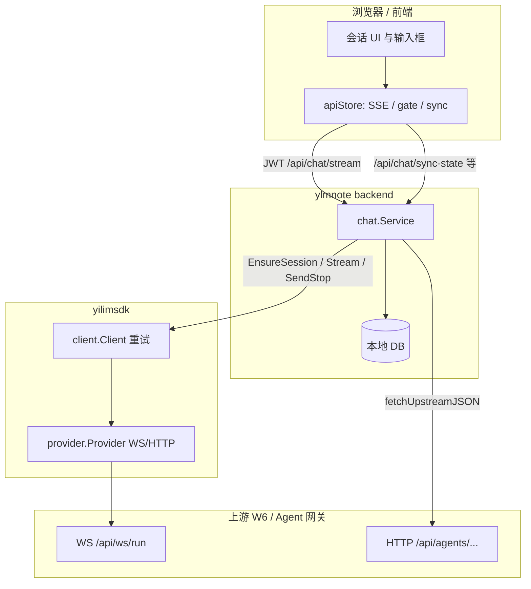
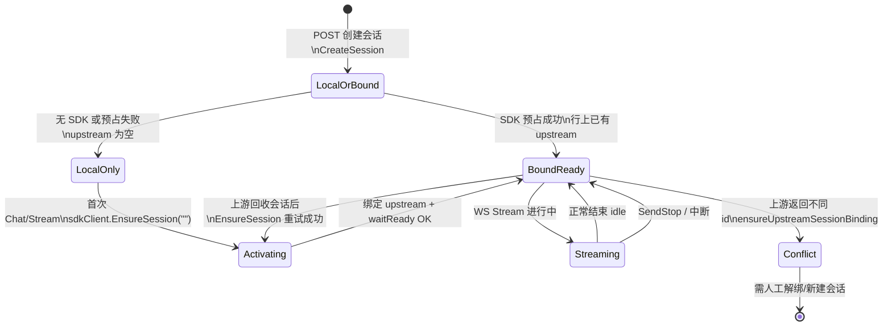
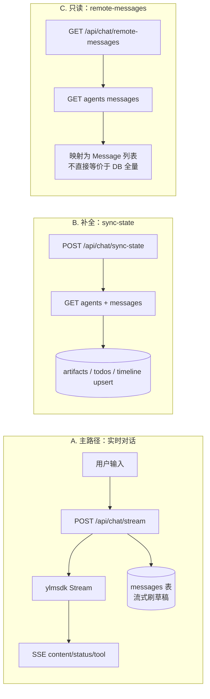

# 远端会话与数据流规范（ylmnote × yilimsdk × W6 上游）

本文档在 [`doc/bak/THIRD_PARTY_INTEGRATION.md`](../THIRD_PARTY_INTEGRATION.md) 的第三方接入说明之上，结合当前仓库内 **yilimsdk**、**backend chat 服务**、**前端 apiStore** 的真实实现，统一术语、远端状态、数据流与异常处理策略，便于后续 SDK 与前端体验重构。

---

## 1. 为何需要这份文档

- **双会话模型**：本地 `Session`（SQLite / 未来 PG）与上游 **Agent 会话**（W6 等 OpenAI 兼容网关里的 `agent_id` / `session_id`）不是同一 ID，必须通过 `sessions.upstream_session_id` 显式绑定。
- **多通道**：实时对话走 **WebSocket**（yilimsdk `Provider`），补全历史与产物走 **HTTP**（`/api/agents/{id}/messages` 等），本应用再通过 **SSE** 把流式事件推给浏览器。
- **旧文档偏差**：`THIRD_PARTY_INTEGRATION.md` 中的示例帧类型大小写、字段名与部分网关实现不完全一致；**以本仓库 `yilimsdk/provider` 与 `backend/internal/application/chat` 为准**。

---

## 2. 术语与标识

| 名称 | 存储 / 出现位置 | 含义 |
|------|-----------------|------|
| **local_session_id** | `sessions.id` | ylmnote 内会话主键，前端路由与 `/api/projects/:id/messages` 等均使用它。 |
| **upstream_session_id** | `sessions.upstream_session_id` | 上游 Agent 会话 ID；传给 yilimsdk `ChatRequest.SessionID`、WS `?id=`、HTTP `/api/agents/{id}/...`。 |
| **upstream_message_id** | `messages.upstream_message_id` | 上游单条消息的稳态 ID，用于 `UpsertByUpstreamID` 去重与增量同步。 |

**不变量**：一个 local session 在任意时刻只对应一个 **稳定** upstream id。库内已有 `upstream_session_id` 时，流式结束若 SDK 报告另一 id（W6 首帧 `update.state.id` 常与 `{"id":hint}` 不一致），**保留库内 id**（`upstream_session_binding_ignored_incoming`）；仅当库内为空时写入新绑定。`sync-state` 显式 `upstream_override` 与库内冲突时仍可能 `409`。

### 2.1 第三条 id、控制台与对账排查

除上表中的 **local_session_id** 与 **upstream_session_id** 外，运维/网关控制台、账单或另一套后台里展示的「会话 id」「Agent id」**不一定**与本表第二列相同：可能是用户维度资源、列表中的**另一条**上游会话、或命名不同的字段。**标题相同 ≠ 同一会话**。

**对账规则**：凡要对比「本地 SQLite 里的消息」与「上游控制台里的历史」，必须先确认双方使用的是 **同一个** `sessions.upstream_session_id`（即 `GET /api/agents/{该 id}/messages` 能访问的那条）。若控制台 id ≠ 库内 `upstream_session_id`，则差异是**对照对象错误**，不是缓存或前端漏刷。

**SQLite 示例**（将 `YOUR_LOCAL_SESSION_ID` 换成路由里的会话 id）：

```sql
SELECT id, project_id, title, upstream_session_id, created_at, updated_at
FROM sessions
WHERE id = 'YOUR_LOCAL_SESSION_ID';
```

记下 `upstream_session_id` 后，仅使用该字符串在上游打开时间线或调用 HTTP；不要用另一条会话 id 反推本地应有相同内容。

**常见误判**：

| 现象 | 更可能原因 |
|------|------------|
| 控制台会话 A，库里绑定 B，A≠B | 看错会话行、或历史上重复激活/手工改库导致绑定与当前控制台会话不一致 |
| 本地消息少、上游多 | `sync-state` 的 timeline 仅 upsert **带 `upstream_message_id`** 的帧（见 §8.1.1）；无稳态 id 的帧不会入库 |
| 刷新后仍旧 | 先查 `sync-state` 是否成功、以及 `sessions.upstream_session_id` 是否为空（空则 `SyncSessionState` 对时间线 noop） |

---

## 3. 与第三方文档的对照（W6 风格上游）

| 能力 | 第三方文档描述 | 本仓库实现 |
|------|----------------|------------|
| 认证 Header | `x-w6service-api-key` | 一致：`yilimsdk/provider` HTTP/WS 均设置。 |
| 实时对话 | `ws://.../api/ws/run`，先发 `auth` | `Provider.buildWSURL` → `WSPath` 默认 `/api/ws/run`，`auth` 帧 `type: auth`, `api_key`。 |
| 用户输入 | `type: "input"` 等 | `streamViaWS` 使用 `type: input`，`content`，`attachments`（可为空数组）。 |
| 停止 | `type: "Stop"` | `SendStop` 发送 `type: Stop`（与文档一致）。 |
| 上游推送 | `Status` / `Thinking` / `Update` / `Error` 等 | 解析时 **统一转小写** `typeLower`，兼容 `thinking`、`update`、`status`、`error`。 |
| 历史消息 | `GET /api/agents/{agent_id}/messages` | `chat.Service` 使用 `/api/agents/{upstream}/messages?limit=&offset=0`。 |

集成第三方页面时，建议同时参考本文档 **第 6 节帧语义** 与 **第 10 节异常矩阵**。

---

## 4. 分层职责（谁做什么）



| 层次 | 职责 |
|------|------|
| **上游** | Agent 生命周期、真实对话状态、消息时间线、文件 source。 |
| **yilimsdk** | WS 建连、鉴权、输入/Stop、解析帧 → 统一 `StreamEvent`；`EnsureSession` 分配或校验 upstream id；可重试错误的退避。 |
| **backend chat** | 鉴权、积分、落库用户句与助手草稿、**激活/绑定** upstream、`upstream-gate` 聚合状态、`sync-state` 拉时间线并持久化产物/待办/消息、`remote-messages` 只读窗口。 |
| **前端** | SSE 消费、乐观 UI、`getUpstreamGate` 控制输入锁与停止按钮、`syncSessionState` 防重入与失败冷却、以 DB 刷新为准；会话消息与流式见 [`chatConversationSlice.ts`](../../frontend/src/stores/chatConversationSlice.ts)（由 `apiStore` 组合）。 |

---

## 5. 远端「运行状态」与 UI 门控（upstream-gate）

后端 `GetUpstreamGate` 将上游 HTTP 元数据折叠为 **`phase`**，供前端决定是否允许发送、是否展示停止。

| `phase` | 典型 `status` | `input_locked` | `can_stop` | 含义与建议 UI |
|---------|---------------|----------------|------------|----------------|
| **ready** | `idle` / `ready` / `normal` / `paused` / `waiting` / `stopped` / `completed` / `done` 或空 | 否 | 否 | 可发下一条；停止非必需。 |
| **busy** | `running` / `busy` | 是 | SDK 可用时为 **是** | 远端正在生成；可点「停止」触发 `SendStop`。 |
| **blocked** | 未知枚举 | 是 | 否 | 保守锁住输入；展示 `detail` 或联系管理员。 |
| **offline** | （拉取 `/api/agents/{id}` 失败） | 是 | 否 | 网络或上游不可用；轮询降频，避免刷屏。 |
| **unbound** | `local` / 无 upstream | 视配置 | 否 | 尚无 `upstream_session_id`（创建时预绑定失败或未配 SDK）：若已配置 SDK，首条消息会 **激活并绑定**；若未配置 SDK 且要求绑定，应锁住并提示（后端已有 `Detail` 文案）。 |

**与 WebSocket 内 `status` 帧的关系**：流式过程中 SDK 会把上游 `status` 转成 `StreamEventStatus`（如 `busy` / `idle`）透传到 SSE；**门控仍以 `upstream-gate` 的 HTTP 轮询结果为准**校准「是否还能发」，避免仅依赖单次长连接视角。

---

## 6. WebSocket 帧 → yilimsdk → SSE 事件

### 6.1 上游 → SDK

| 上游 `type`（大小写不敏感） | SDK 行为 |
|-----------------------------|----------|
| `thinking` | 追加文本；映射为 `StreamEventContent`。 |
| `update` | 从 `messages` 解析助手全文快照，**转增量** `content` 事件；可附带 `tool` 事件（artifacts / todos JSON）。 |
| `status` | `StreamEventStatus`；`idle` 且已有内容时结束流；`idle` 在曾 `busy|running` 后且无内容 → `ErrProtocol`（协议异常）。 |
| `error` | `ErrUpstream4xx` 风格 `SDKError`，终止流。 |

任意帧可通过 `state` / `state_delta` / 顶层字段推断 **upstream session id**（`inferUpstreamSessionID`），并与请求中的 hint 比对；不一致时以 debug 日志记录并可能忽略。

**W6 官网 `/run` 握手（`yilimsdk/provider`）**：与浏览器 DevTools 一致——**不再**用 URL `?id=` 传会话 id（见 `buildWSURL`），改为：`auth` →（若已有 upstream id）`{"id":"<upstream_session_id>"}` → 读到带 `state.id` 的 `update` → 再读到一条可接受的 `status`（`w6WaitRunHandshake`）→ 之后 **`EnsureSession` 返回** 或 **`Stream` 才发送 `input`**。若 `update.state.id` 与 hint 不一致，**仍以 hint 为权威**（避免首帧展示他 run id 导致反复换绑）。新会话（hint 空）则使用首包 `update` 中服务端分配的 id。`SendStop` 同样在发 `Stop` 前完成该握手。

### 6.2 SDK → 后端 SSE → 前端

后端在流开始前发送 `status: connecting_upstream`。

**握手完成后、首条 `content` 之前**，yilimsdk 会发出 **`upstream_handshake`**（`StreamEventUpstreamHandshake`），`value` 为 JSON 字符串，字段示例：

- `upstream_session_id`：本条 WSS 上解析出的 canonical 上游 id（与 hint 对齐策略见 §6.1）。
- `handshake_verified`：是否与官方首包 `update.state.id` 对齐（与 `sessions.upstream_verified` 写入策略一致，见应用层）。

其后才是主循环转发的 `content` / `status` / `tool` 等。

**流完全结束后**，[`chat_handler.chatStream`](../../backend/internal/interfaces/http/chat_handler.go) 再写入：`session_id`（值为 **local** `result.SessionID`）、`status_clear`、`status: session:{local_session_id}`。

**注意**：

- **`session_id`（末尾）与 `upstream_handshake` 里的 `upstream_session_id` 不是同一概念**：前者是 **local_session_id**（路由/DB 主键）；后者是 **上游 Agent 会话 id**。不要在产品文案或调试里混用。
- DevTools 里「`session_id` 出现在 `done` 之后」是 **HTTP 层编排**（整段 `Stream` 返回后再写 SSE），**不是** SDK 在 WSS 里晚发 `{"id"}`。WSS 上的 id 与握手在 `streamViaWS` 内、发 `input` 之前已完成。

### 6.3 SSE 与浏览器 DevTools 直连 WSS 的观测差异

| 观测对象 | 你能看到什么 | 说明 |
|----------|----------------|------|
| 浏览器 → 上游 `run`（图二） | 原始帧：`auth` → `{"id"}` → `update` / `status` … | 与 yilimsdk 发送顺序一致。 |
| 浏览器 → 本应用 `POST /api/chat/stream`（SSE） | 仅后端**转发**的 `StreamEvent`；握手阶段在 SDK 内消费，**不会**以原始 WSS 帧出现。 | 因此 SSE 里不会复刻「先两条下行再 input」的视觉顺序；**`upstream_handshake`** 用于在应用层标记「握手已结束、canonical upstream id 已知」。 |
| 双连接 | `activateUpstreamSession` 内可能已 `EnsureSession`（短 WSS）；随后 **`Stream` 再建第二条 WSS** 并再次握手再发 `input`。 | 与单页长连相比多一次建连；若上游对并发敏感需用日志与上游侧一起排查。 |

---

## 7. 会话生命周期（创建、激活、停止、再激活）

### 7.0 创建会话与上游预绑定（`POST .../sessions`）

[`project.Service.CreateSession`](backend/internal/application/project/service.go) 在落库前：若注入了 **AI SDK**（`aiSDK != nil`），会调用 `allocateUpstreamSessionID`（内部即 `EnsureSession("")`）向网关 **预占一条** `upstream_session_id` 并写入新行。此后首条 `chat/stream` 的 `prepareSessionAndSaveUserMessage` 会读出非空 hint，`activateUpstreamSession` 走 **resume**（`EnsureSession(已有 id)`），减少「首条流未结束就刷新 → 库里仍无 upstream → 再发又新开网关会话」的窗口。

**回退（与旧版兼容）**：无 SDK、或 `EnsureSession` 失败（网络/上游不可用）时，**仍创建本地会话**，`upstream_session_id` 保持 **NULL**；日志 `[project] CreateSession eager upstream bind skipped`。首条聊天行为与改造前一致（`EnsureSession("")` 再绑定）。列表/详情响应里 `upstream_session_id` 字段已随 [`toSessionResponse`](backend/internal/interfaces/http/project_handler.go) 返回，便于与控制台对账。

### 7.1 总览状态机（逻辑视图）



### 7.2 激活管道 `activateUpstreamSession`（后端）

1. 若 `sdkClient == nil`（legacy）：无上游，直接用 local id 当作占位，不绑定。
2. 否则对 `EnsureSession(hint)` 最多 **5 次**；`hint` 为空表示让上游**新开会话**。
3. `ensureUpstreamSessionBinding`：写入或校验 `upstream_session_id`。
4. `waitUpstreamSessionReady`：轮询 `/api/agents/{id}`，直到状态为 `idle|running|busy|ready|normal|paused|waiting|stopped|completed|done` 等或超时（超时返回错误，阻止本次发送）。

**再激活**：停止（Stop）或断线后，只要 **local 行上仍保留原 `upstream_session_id`**，下次发送会再次 `EnsureSession(已有 id)` + `waitReady`；若上游已删除该 Agent，会进入 SDK 重试或最终错误，前端应捕获并引导用户「新建会话」或重新绑定。

### 7.3 停止 `SendStop`

- 条件：`upstream_session_id` 非空且 `sdkClient` 非 nil。
- 行为：独立短连接 WS，auth 后消费少量帧，再写 `Stop`。
- 不可用：`ErrUpstreamStopUnavailable`（503）或 `IsNotImplemented`（501）。

停止成功后，远端应进入可再次输入的状态；前端应 **`getUpstreamGate` 轮询确认 `phase=ready`** 再解锁输入框。

### 7.4 错误绑定、人工改库与纠正

若运维或脚本直接改了 `sessions` 行、或历史上出现「控制台里一条会话、库里绑定另一条」：

- **`sync-state` 始终按库内 `upstream_session_id` 拉 HTTP**（[`SyncSessionState`](../../backend/internal/application/chat/service.go)）；绑定错了就会整段拉错会话，与你在另一界面看到的「正确」会话永远对不齐。
- **纠正方式**：优先在业务上 **新建本地会话** 再对话；若必须保留本地 `sessions.id`，可调用已存在的 **`PATCH /api/projects/:project_id/sessions/:session_id/upstream`**（[`bindSessionUpstream`](../../backend/internal/interfaces/http/project_handler.go)）将 `upstream_session_id` 显式改成与上游一致的唯一 id。改后应再执行一次 `sync-state` 并 `refreshMessages`。
- **与 409 的关系**：流式结束若 SDK 报告 id 与库内已绑定不一致，[`ensureUpstreamSessionBinding`](../../backend/internal/application/chat/service.go) **保留库内**（`upstream_session_binding_ignored_incoming`）；`409` 主要出现在 `sync-state` **显式 override** 与库内冲突时。

---

## 8. 消息与历史数据流

### 8.1 三条路径（不要混用语义）



| 路径 | 何时用 | 持久化 | 说明 |
|------|--------|--------|------|
| **A** | 用户发送 | 用户消息插入 + 助手内容流式 `UpdateContent` | 权威反映「本次生成」；工具/artifact 另由 capture 逻辑处理。 |
| **B** | 前端 `syncSessionState`（如流结束后 `refreshMessages`） | `persistTimelineMessages` 等，仅 **带 `upstream_message_id` 的帧** upsert | 对齐上游完整时间线、产物、待办；无稳态 id 的帧会跳过以防重复。 |
| **C** | 分页浏览「远端视角」或调试 | 默认不落库 | `skip/limit` 在**时间线最新段**上切片；与本地列表可能因过滤/去重不一致。 |

### 8.1.1 `persistTimelineMessages` 与流式草稿：为何条数仍可能与「纯远端 raw」不同

- **路径 A（流式）**：助手侧在 [`Stream`](../../backend/internal/application/chat/service.go) 中先插入一条 **本地 `messages.id`** 的草稿，再通过 `UpdateContent` 按增量刷正文；该阶段通常 **不带** `upstream_message_id`（与上游 WS 帧一一对应尚未落稳态 id）。
- **路径 B（`sync-state`）**：[`persistTimelineMessages`](../../backend/internal/application/chat/service.go) 对 HTTP 时间线逐帧 `UpsertByUpstreamID`，但 **显式跳过**「无稳定 `UpstreamID`」的帧（代码注释：避免刷新重复）。因此：**上游 raw 列表里的条数 ≥ 本地经 B 路径 upsert 后的条数** 是允许的。
- **合并观感**：同一次用户发送可能先有一条流式草稿（A），同步后又出现带 `upstream_message_id` 的条目（B）；展示层若不去重，可能出现「两条像重复」的观感，需以后端约定字段（如 `upstream_message_id`）或产品策略收敛。
- **与 §8.3 叠加**：`classifyUpstreamKind` 会丢弃部分 `kind`，本地持久化的是**业务子集**，不是上游全量 raw dump；与控制台「导出全部帧」对比时仍会不一致。

### 8.2 本地列表 vs 上游时间线（前端实现约定）

- **聊天主列表**：`apiStore` / [`chatConversationSlice.ts`](../../frontend/src/stores/chatConversationSlice.ts) 中的 `fetchMessagesBySession` 使用 **`GET /api/projects/:project_id/sessions/:session_id/messages`**（`projectApi.getSessionMessages`），分页参数 `skip` / `limit` 与后端 `ListMessagesBySession` 一致；**不再**用 `GET /api/chat/remote-messages` 作为默认列表来源，避免与 `sync-state` 写入的本地 DB 漂移。
- **`remote-messages`**（`chatApi.getRemoteMessages`）：保留在 [`api.ts`](../../frontend/src/services/api.ts) 供调试或未来「纯远端视图」；与主聊天 UI 合并时必须按 **`upstream_message_id` / `id`** 去重。
- **用户发消息、流结束**：仍先 `syncSessionState(..., refreshMessages: true)`，再 `fetchMessagesBySession`，保证 artifact / todo / timeline upsert 后 UI 与 SQLite 一致。

### 8.3 `classifyUpstreamKind`（后端从上游 messages 解析）

仅部分 `kind` 会进入时间线与持久化，例如：`from_user`、`user_facing`、`reasoning` 等；`episodic_marker` 等被丢弃以降低噪声。前端展示「思考过程」需读 `attachments.is_process` / `upstream_kind`。

---

## 9. 前端建议状态（当前实现）

| 能力 | 实现位置 |
|------|----------|
| `upstream-gate` 轮询 | [`useUpstreamGate.ts`](../frontend/src/hooks/useUpstreamGate.ts)：TanStack `useQuery` + `refetchInterval`（busy/offline/blocked 约 2.5s，ready/unbound 约 12s；流式中 `isStreaming` 为真时暂停轮询）。 |
| Banner 文案 | 同文件 `getUpstreamGateBannerText`。 |
| 流结束刷新 gate | [`ProjectDetail.tsx`](../../frontend/src/pages/ProjectDetail.tsx)：`isStreaming` 由 true→false 时 `invalidateQueries(['upstreamGate', projectId, sessionId])`。 |
| 会话切换 / 停止 / 卸载 | 调用 `abortActiveMessageStream()`，中止当前 SSE `fetch`（[`chatConversationSlice`](../../frontend/src/stores/chatConversationSlice.ts) 内 `AbortController`）。 |
| `sync_meta` | `sessionSyncMeta`：`inFlight` / `lastFailedAt` / `isTerminal`（409 冲突时 terminal）。 |

**体验要点**：

1. 发送前使用 gate 的 `input_locked`（`ProjectDetail` 传入 `AIChatBoxNew`）。
2. 流式结束仍由 `sendMessageStream` 末尾调用 `syncSessionState(..., refreshMessages: true)`。
3. `sync-state` 沿用防重入与 30s 失败冷却（`useSessionSync` + `syncSessionState`）。

---

## 10. 异常与 HTTP 映射（处理清单）

| 场景 | 典型错误 / HTTP | 建议处理 |
|------|-------------------|----------|
| 上游 API Key 无效 | SDK `unauthorized` | 检查后端 `AI_SDK_*` / 上游 key；不可重试。 |
| 限流 / 5xx / 网络 | SDK `rate_limited` / `upstream_5xx` / `transport` | 依赖 `client` 内重试；仍失败则 toast + 退避。 |
| `EnsureSession` 无法解析 id | `protocol_error` | 检查上游 WS 首包是否含 `state.id` 等；或 fallback HTTP 校验。 |
| 本地已绑定 A，流式完成报告 B | **保留 A**（忽略 B，打 `upstream_session_binding_ignored_incoming`）；首绑仍仅当库内为空时写入。 |
| 需要 upstream 但未绑定 | `400` / `ErrUpstreamSessionUnbound` | 不应在「无 sdk 且未绑定」时发消息；首条消息前等待激活完成。 |
| Stop 不支持 | `501` / `503` | 隐藏停止按钮或降级为「仅本地停止 SSE」。 |
| `waitReady` 超时 | 聊天返回错误 | 展示上游未就绪；可提供重试，记录 `upstream_session_id`。 |
| `sync-state` 失败 | `502` | 进入冷却，勿阻塞发送；可选展示弱提示。 |
| 仅配置了上游但未启用 SDK | gate `Detail` 已说明 | 锁住输入直至绑定 `upstream_session_id` 或启用 sdk。 |

---

## 11. yilimsdk 重构方向（与本文档对齐）

1. **显式会话阶段 API**：在文档层或代码注释中固定 `EnsureSession(empty) → new`、`EnsureSession(id) → resume` 语义，与后端 `activateUpstreamSession` 一一对应。
2. **帧类型 schema**：建议增加可选 JSON Schema 或生成类型，区分「网关变体」，减少 `inferUpstreamSessionID` 只靠启发式的风险。
3. **Update 非前缀增长**：当前策略是「首段可见、最终以快照为准」；可考虑向上层暴露 `snapshot` 事件，让前端用整段替换而非只追加。
4. **与 HTTP 对齐**：`SendStop` / `Stream` / `EnsureSession` 共享连接池或 trace id，便于日志关联 `local_session_id`（需在 backend 传参扩展，属后续工作）。
5. **SSE 与 WS 事件对齐表**：维护一张表映射 `StreamEventType` ↔ 上游 `type`；应用层已增加 `upstream_handshake`（握手完成、canonical upstream id），便于第三方对照。

---

## 12. 相关代码索引（仓库内）

| 模块 | 路径 |
|------|------|
| SDK 客户端与重试 | `yilimsdk/client/client.go` |
| WS 实现 | `yilimsdk/provider/provider.go` |
| 流式类型 | `yilimsdk/types/types.go` |
| SSE 写出 | `yilimsdk/stream/sse.go` |
| Chat 业务与同步 | `backend/internal/application/chat/service.go`（`slog`：`upstream_session_binding` / `upstream_session_binding_conflict` / `sync_session_state_skip` / `sync_session_state_done`） |
| 项目与会话创建（含预绑定上游） | `backend/internal/application/project/service.go`（`CreateSession` / `allocateUpstreamSessionID`）、`backend/internal/interfaces/http/project_handler.go`（`createSession`） |
| HTTP 路由 | `backend/internal/interfaces/http/chat_handler.go` |
| 前端会话消息 / 流式 / sync | `frontend/src/stores/chatConversationSlice.ts` |
| 前端项目级 store | `frontend/src/stores/apiStore.ts` |
| upstream-gate hook | `frontend/src/hooks/useUpstreamGate.ts` |
| 前端 API | `frontend/src/services/api.ts` |

---

## 13. 修订记录

| 日期 | 说明 |
|------|------|
| 2026-04-15 | 初版：整合 `THIRD_PARTY_INTEGRATION.md` 与当前 yilimsdk / chat / 前端实现。 |
| 2026-04-15 | 对齐前端：`getSessionMessages` 为主列表、`useUpstreamGate`、流式 Abort、`chatConversationSlice`；更新 §8–§9 与代码索引。 |
| 2026-04-15 | 增补 §2.1 三条 id 与 SQLite 对账、§7.4 错误绑定与 PATCH upstream、§8.1.1 timeline 与流式草稿差异说明；后端绑定/sync 增加结构化日志（见 `chat.Service`）。 |
| 2026-04-15 | §7.0：`CreateSession` 在配置 SDK 时预占 `upstream_session_id`；失败时仍创建仅本地会话；§7.1 状态机同步。 |
| 2026-04-15 | §6：W6 官网握手顺序（auth → `{"id"}` → update+status → input）；`yilimsdk` 移除 WS URL `?id=`。 |
| 2026-04-15 | §6.2–§6.3：SSE 与浏览器 WSS 观测差异、双连接、`session_id`（末尾）为 **local**；新增 SSE 事件 **`upstream_handshake`**（握手后、content 前）；空 hint 时 `[sdk-w6]` / `[chat]` 日志说明。 |
