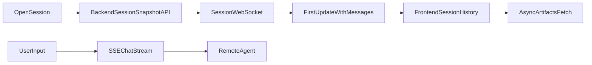

# WSS 历史快照真源方案

## 目标
- 会话历史以 WebSocket 首个 `update.messages` 快照为唯一真源。
- 用户打开会话时后端建立该会话 WebSocket；若远端仍处于 `running/busy`，连接保持不立即断开。
- 建连失败不回退 HTTP 历史接口，只给用户错误与重试入口。

## 现状锚点
- 后端已具备会话级 WSS 连接与帧解析基础：[`/Users/leven/space/react/youmind/backend/internal/infrastructure/ai/gateway/provider/provider.go`]。
- 现有聊天主链路为 SSE：[`/Users/leven/space/react/youmind/frontend/src/services/api.ts`] 的 `chatApi.stream`。
- 前端会话切换入口在 [`/Users/leven/space/react/youmind/frontend/src/pages/ProjectDetail.tsx`] 与 [`/Users/leven/space/react/youmind/frontend/src/stores/chatConversationSlice.ts`]。

## 实施步骤

### 1) 后端新增“会话历史快照”接口（基于 WSS）
- 在 [`/Users/leven/space/react/youmind/backend/internal/application/chat/service.go`] 增加 `FetchSessionHistorySnapshot(...)`：
  - 建立会话 WSS（带 session id）。
  - 循环读取帧，直到遇到 `type=update` 且含 `messages`。
  - 将 `messages` 转为前端消息结构后返回。
  - 解析采用“按类型识别”而非“第 N 条消息”，防止顺序抖动。
- 在 [`/Users/leven/space/react/youmind/backend/internal/interfaces/http/chat_handler.go`] 新增路由（如 `/api/chat/session-history-snapshot`）。

### 2) 前端切会话时改走快照接口
- 在 [`/Users/leven/space/react/youmind/frontend/src/stores/chatConversationSlice.ts`] 中：
  - `replaceLatest` 改为调用新快照接口。
  - 收到快照后直接覆盖当前会话消息（真源切换）。
  - 保留 `prependOlder` 逻辑可暂时不支持，或后续再补分段历史。
- 在 [`/Users/leven/space/react/youmind/frontend/src/services/api.ts`]：
  - 增加 `chatApi.getSessionHistorySnapshot` 类型定义与调用封装。

### 3) 生命周期控制
- 在 [`/Users/leven/space/react/youmind/frontend/src/pages/ProjectDetail.tsx`]：
  - 进入会话触发一次快照请求。
  - 离开会话取消未完成请求/流；但若远端状态仍为 `running/busy`，保持连接直到状态回落。
  - 流式结束后可选择再触发一次快照校准（非轮询）。
- 在后端会话快照服务中：
  - 监听 `status` 帧；`running/busy` 维持连接，`idle/done/paused/stopped` 触发收尾并断开。
  - 增加连接上限（如 60-120s）防止异常长连泄漏。

### 4) artifacts 异步拉取
- 快照历史先渲染文本与结构消息。
- artifacts / todos 通过现有资源接口异步补齐，避免首屏阻塞。

### 5) 错误策略（无 fallback）
- 建连或快照解析失败时：
  - 前端展示“历史同步失败，点击重试”。
  - 不回退本地 DB，不回退 `/remote-messages`。
  - 后端记录结构化日志便于定位。

## 数据流（目标态）

## 验收标准
- 切会话后历史由首个 `update.messages` 一次性恢复，不再出现“少历史”。
- 前端不再主动拉本地 DB 历史，也不使用 HTTP 历史回退。
- 会话离开后若远端 `running/busy`，连接继续到任务完成再释放；非运行态立即释放。
- artifacts 在历史首屏后异步补齐，不阻塞对话可读性。