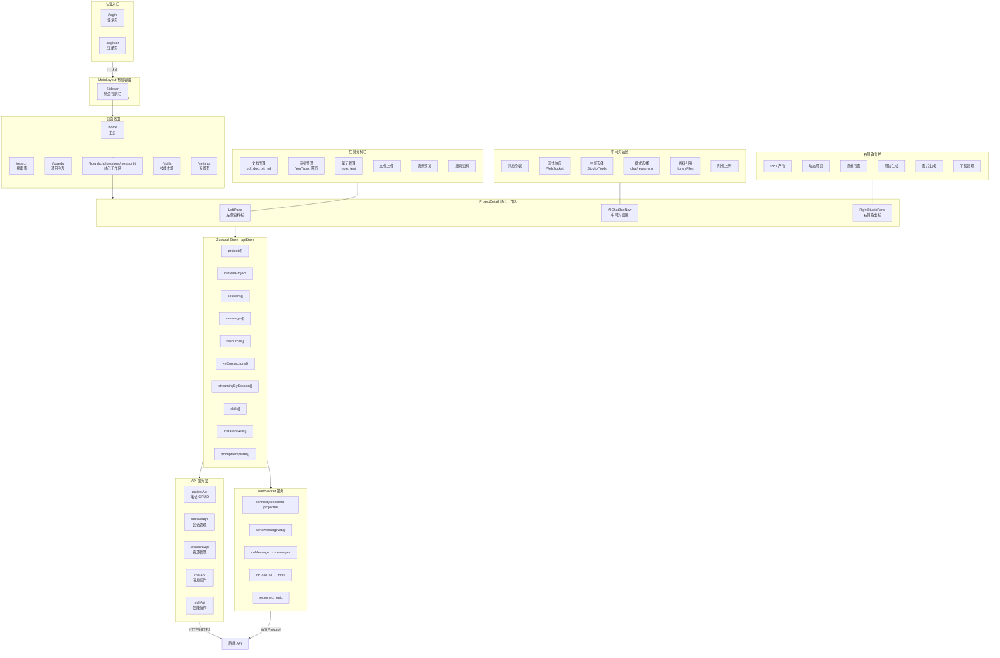
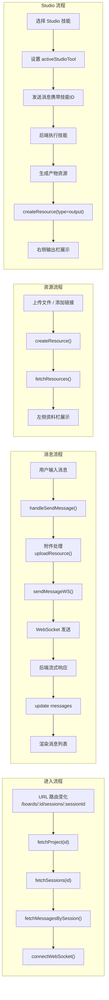
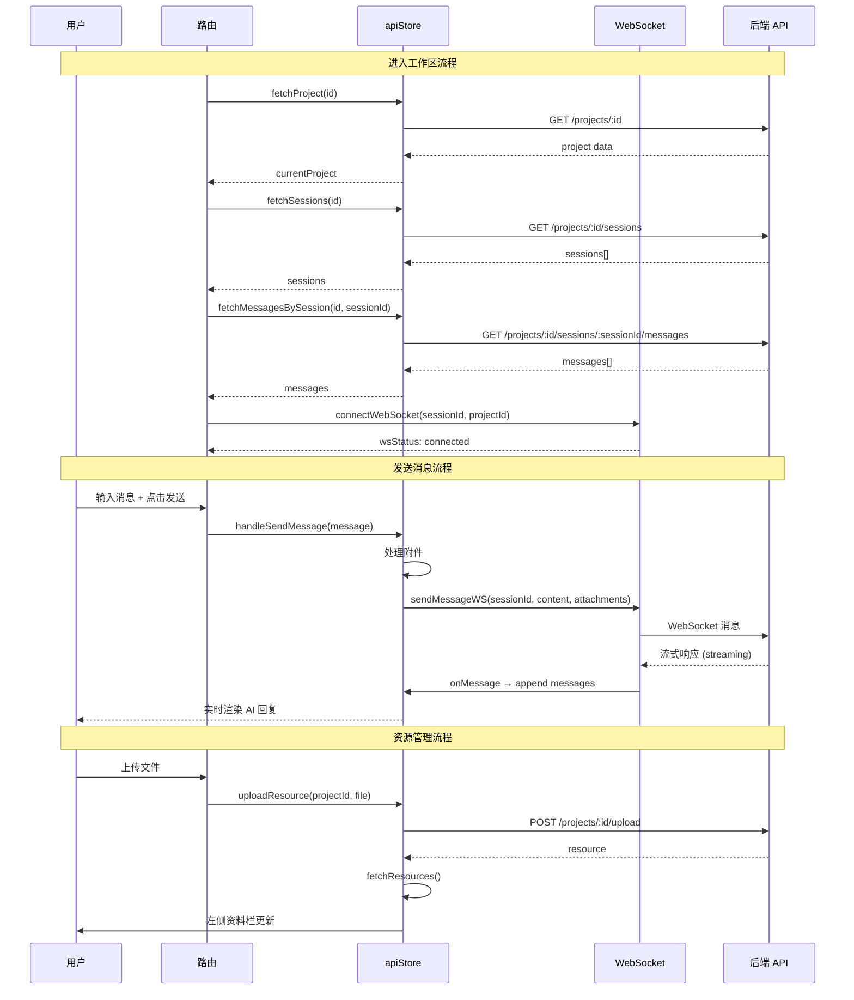
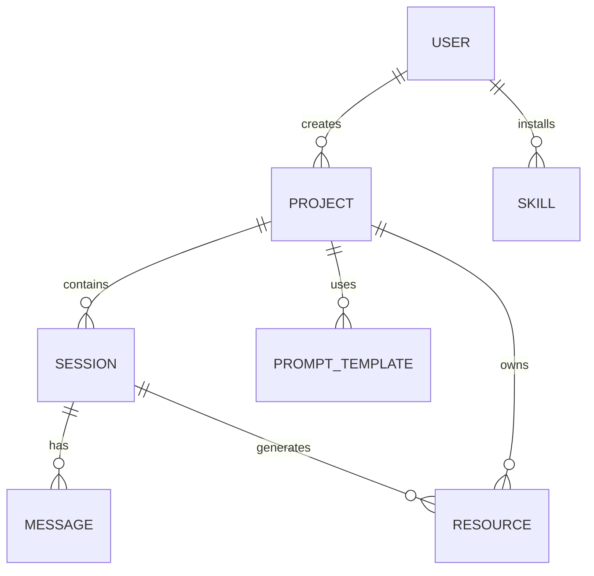

# 前端交互流程图（Mermaid）

## 核心工作区详细流程

## 组件交互时序

## 数据模型关系

## 技术栈

| 层级 | 技术 |
|------|------|
| 路由 | React Router v6 |
| 状态管理 | Zustand |
| 数据获取 | TanStack Query |
| HTTP 客户端 | Fetch API |
| 实时通信 | WebSocket |
| UI 框架 | React + TypeScript |
| 样式 | Tailwind CSS |
| 组件库 | lucide-react (图标) |